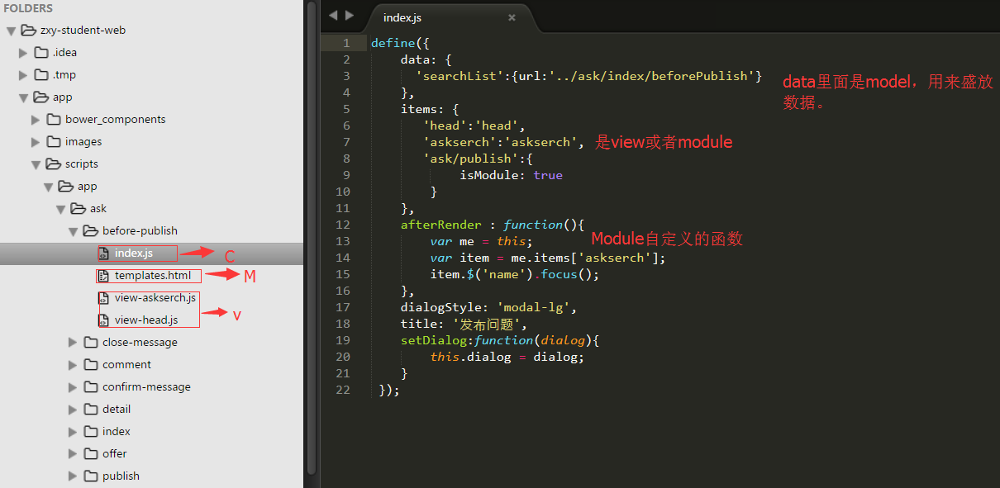

1.module生命周期

执行**beforeRender** -> 获取**model**数据（**autoLoad=true**） -> 渲染**Layout**对象 -> 执行**afterLayoutRender** -> 异步渲染所有**items**（**View**或者**Module**）
-> 执行**afterRender** -> 获取**model**数据（**autoLoad=afterRender||after**） -> 完成



2.view生命周期

执行**beforeRender** -> 取得绑定的**model**对象中Json -> 执行**adjustData**方法 -> 渲染模板（加载**region**）-> 异步调用组件
-> 调用定义文件中定义的**afterRender**方法 -> 

```JavaScript
define({
    bind: {                //**bind里面是绑定的model**
      'searchList':''
    },
    events: {              //**定义事件**
         'keyup name': 'serachAsk'
    },
    handlers: {
    	serachAsk: function() {
        var layout = this.module.layout;
    		var me = this;
        var askserch = me.module.items['askserch'];
    		var name = me.$("name").val();
        name = name.replace(/\s+/g,"")

    		var reg = /^\s*$/;
        if(reg.test(name)){
            askserch.$("searchId").attr("style","display:none");
            return;
        }
        var len =name.length;
        if(len>200){
          layout.$("show-error").attr("style","display:block");
          layout.$("show-error").html("已超出"+Math.round(len-200)+"字");
          askserch.$("pushId").hide();
          return;
        } else{
          layout.$("show-error").attr("style","display:none");
        }

        name = encodeURI(name);
        var list=this.data.searchList,
        params = list.params;
        params['title'] = name;
        list.params = params;
        list.get().done(function(){
           askserch.render();
           askserch.$("searchId").attr("style","display:block");
           askserch.$("pushId").attr("style","display:block");
        });
        }
    },
  extend: {
    strlen: function (str){
      var len = 0;
      for (var i=0; i<str.length; i++) {
        var c = str.charCodeAt(i);
        //单字节加1
        if ((c >= 0x0001 && c <= 0x007e) || (0xff60<=c && c<=0xff9f)) {
          len++;
        }
        else {
          len+=2;
        }
      }
      return len;
    }
  }
});
```

3.AMD规范

_全称是Asynchronous Module Definition，即异步模块加载机制。_ 典型的遵循AMD规范的js包括SeaJs和RequireJs等，与之相对的还有cmd规范和commonJs规范。
作为一个规范，只需定义其语法API，而不关心其实现。AMD规范简单到只有一个API，即define函数：

　　define([module-name?], [array-of-dependencies?], [module-factory-or-object]);

　　其中：

　　module-name: 模块标识，可以省略。

　　array-of-dependencies: 所依赖的模块，可以省略。

　　module-factory-or-object: 模块的实现，或者一个JavaScript对象。

　　从中可以看到，第一个参数和第二个参数都是可以省略的，第三个参数则是模块的具体实现本身。后面将介绍在不同的应用场景下，他们会使用不同的参数组合。

```JavaScript
require([
    'drizzle', 'jquery', 'app/util/helpers', 'config', 'vendor','app/ext/tag-card',
    'app/ext/tree', 'app/ext/dialog-region', 'app/ext/select-column','app/ext/pager',
    'app/ext/file-upload', 'app/ext/validate','app/ext/face','app/ext/number-pager',
    'app/ext/editor','app/ext/base64','app/ext/my-datepicker'
], function(D, $, helpers, config) {

});
```
