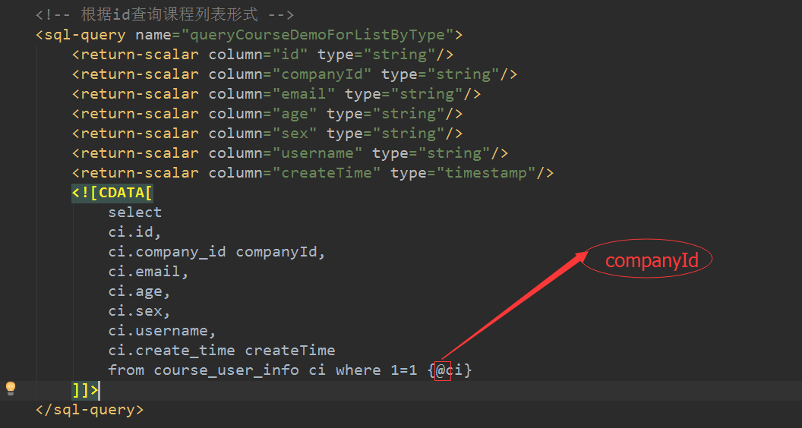

1.zxy-manage前端。

  a.jsp中扦插JSTL标签，如以下代码：
  
  ```
  <c:out value="${basePath} //用于动态获取值
  <lds:text name=""/>     //动态获取文本信息
  ```
  
  b.js中封装jpgrid插件。 
  
  [jpgrid API](http://blog.csdn.net/yjlwl1213/article/details/41750703)
  
  caption：表格名称。
  
  rowNum：在grid上显示记录条数，这个条数会被传递到后台。
 
2.zxy-mange特色代码。

  空格当as使用，@当入参使用。

  
  
  BaseEntity封装id
  
  ```Java
  @MappedSuperclass
  @IdClass(CompanyPK.class)   //**自定义注解，封装联合主键**
  public abstract class BaseEntity implements Serializable {
  	private static final long serialVersionUID = 5866690640831557858L;
  	
  	protected String id;
  	protected String companyId;
  	
  	@GenericGenerator(name = "generator", strategy = "uuid.hex")  // **自动生成UUId注解**
  	@Id
  	@GeneratedValue(generator = "generator")
  	@Column(name = "ID", unique = true, nullable = false, length = 40)
  	public String getId() {
  		return id;
  	}
  	public void setId(String id) {
  		this.id = id;
  	}
  	
  	@Id
  	@Column(name = "COMPANY_ID", length = 40)
  	public String getCompanyId() {
  		return companyId;
  	}
  	public void setCompanyId(String companyId) {
  		this.companyId = companyId;
  	}
  ```
  
3.zxy-student和zxy-mange

```java
    /**
     * @param subject
     * @param context
     * @return List<TrainLecturerDto>
     * @Discription:首页-最热问题
     * @Author: zhangtc
     * @Date: 2015-7-8 下午07:29:08
     * @ModifyUser：zhangtc
     * @ModifyDate: 2015-7-8 下午07:29:08
     */
    @RequestMapping(value = "queryHomePopularIssue", method = RequestMethod.GET)
    @Params
    @Permitted
    @JSON("*")
    @CachedResult(key = "home_issue")
    public List<AskQuestionDto> queryHomePopularIssue(SaaSSubject subject, RequestContext context) {
        int num = GlobalConstant.HOME_ASK_NUM;
        return homeAskService.queryHomePopularIssue(num);
    }
```


```Java
    /**
     * 获取云中心在线课程
     * @return
     */
    public String toGetSyncCourse() {
        if (null == courseInfo) {
            courseInfo = new CourseInfo();
        }
        List<CourseInfoDto> resultList = courseInfoService.queryCloudCourseInfoForList(courseInfo.getName());
        this.getHttpServletRequest().setAttribute("resultList", resultList);
        this.getHttpServletRequest().setAttribute("courseName", courseInfo.getName());
        return "toGetSyncCourse";
    }
```


看返回值，上面返回的是一个list，并用list将数据带到前台；而下面是通过request将数据带到前台的。