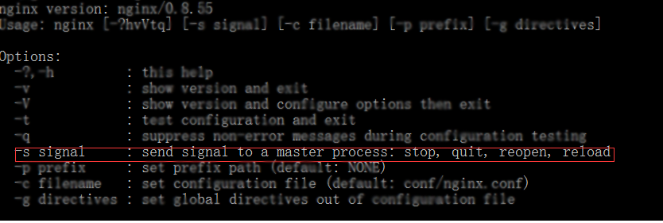
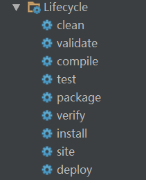

1.nginx反向代理
nginx是基于事件机制的一种静态服务器，会有一个master主进程去执行守护程序，会有多个worker进程执行业务程序。

nginx负载均衡算法有以下三种：
(1)权重算法。
(2)ipHash算法。
(3)轮询算法。

upstream(上游)通过请求后端服务器得到内容。--------请求并取得响应内容的整个过程已经被封装到nginx内部，所以upstream模块只需要开发若干回调函数，完成构造请求和解析响应等具体的工作

```
worker_processes  1;  //只有一个woker进程    

events {
    worker_connections  1024;   //这个worker进程的最大连接数为1024
}


http {
	client_max_body_size 20m;
    include       mime.types;
    default_type  application/octet-stream;


    sendfile        on;
    keepalive_timeout  65;
	upstream oauth-provider_address{  
	server localhost:8081;
    }
    upstream zxy-student_address{   #ip hash算法
        #ip_hash;
        #server 192.168.0.1:8080;
        #server 192.168.0.2:8081;
        #server 192.168.0.3:8082;
        server localhost:8080;
    }
    upstream zxy-manage_address{  #权重算法
        #server 192.168.0.1:8081 weight=5;
        #server 192.168.0.2:8082 weight=10;
        #server 192.168.0.3:8083 weight=5;
        server localhost:8080;
    }
	upstream zxy-cloud_address{
	server localhost:8080;
    }
    upstream security-center_address{
        server localhost:8080;
    }

    server {
        listen       80;
        server_name  localhost;
		index index.html index.htm index.php;   
		root	     html;
		client_max_body_size    10000m;
		access_log off; 
		charset utf-8;
		location /zxy-student-web/
		{
		
			 alias E:/code/zxy-student-web/app/;
		} 
		location /zxy-manage
		{
			 proxy_redirect off;
			 proxy_set_header Host $host;
			 proxy_set_header X-Real-IP $remote_addr;
			 proxy_set_header X-Forwarded-For $proxy_add_x_forwarded_for;
			 proxy_pass http://zxy-manage_address;   #反向代理地址
		}
		location ~/oauth-provider
		{
			proxy_redirect off;
			proxy_set_header Host $host;
			proxy_set_header X-Real-IP $remote_addr;
			proxy_set_header X-Forwarded-For $proxy_add_x_forwarded_for;
			proxy_pass http://oauth-provider_address;
		}
		location /zxy-student
		{
			proxy_redirect off;
			proxy_set_header Host $host;
			proxy_set_header X-Real-IP $remote_addr;
			proxy_set_header X-Forwarded-For $proxy_add_x_forwarded_for;
			proxy_pass http://zxy-student_address;
		}
		location /zxy-cloud
		{
			proxy_redirect off;
			proxy_set_header Host $host;
			proxy_set_header X-Real-IP $remote_addr;
			proxy_set_header X-Forwarded-For $proxy_add_x_forwarded_for;
			proxy_pass http://zxy-cloud_address;
		}
		location /security-center/api/ {
		    proxy_redirect off;
		    proxy_set_header Host $host;
		    proxy_set_header X-Real-IP $remote_addr;
		    proxy_set_header X-Forwarded-For $proxy_add_x_forwarded_for;
		    proxy_pass http://security-center_address;
		}
        location / {
            root   html;
            index  index.html index.htm;
        }
    }
}
```

2.nginx常用命令

(1)启动时指定配置文件
nginx -c /opt/nginx/1.6.2/conf/nginx.conf

(2) 运行时重载配置文件
当nginx主进程接收到重载配置文件的命令后，它会先检查新配置文件的合法性，然后将该配置文件应用。然后，主进程会启动一个新的工作进程，并发送关闭请求给旧的工作进程。旧的工作进程接收到关闭请求后，会停止接受新的连接，并继续服务旧的连接请求直到所有的请求完成后才退出。
nginx -s reload

(3) 运行时快速关闭nginx
nginx -s stop

(4) 运行时优雅关闭nginx
所有的工作进程会停止接受新的连接，并继续服务旧的连接请求直到所有的请求完成后才退出。
nginx -s quit

(5) 运行时重新打开日志文件
ngnix -s reopen

可用如下命令查询nginx相关命令：
```bash
D:\nginx-0.8.55>nginx -h
```

查询结果如下图所示：



3.用grunt检查测试js代码

```bash
E:\code\zxy-student-web>grunt
```

4.生命周期的运用

用bower引入js，并管理js库版本。类似的gulp，webpack
```bash
E:\code\zxy-student-web>bower install
```

用npm初始化js库
```bash
E:\code\zxy-student-web>npm install
npm WARN package.json zxy-student-web@ No description
npm WARN package.json zxy-student-web@ No repository field.
npm WARN package.json zxy-student-web@ No README data
npm WARN package.json zxy-student-web@ No license field.
```
```bash
npm update [-g] [<name> [<name> ...]]
npm uninstall [@<scope>/]<package> [--save|--save-dev|--save-optional]
npm rm (with any of the previous argument usage)
```

用maven管理java的jar包



**问题：还有没有其他的生命周期的运用场景？**